# System Design: MyRewards

## Referências

- **[Concept Doc](CONCEPT.md)** — Problema, dores, job to be done.
- **[TDD (Technical Design Document)](TDD.md)** — Regras de negócio, modelo de dados, fluxos, Stripe.

Este documento descreve a **arquitetura do sistema**, **componentes**, **fluxo de dados** e **entrega mobile-first**, pronta para desenvolvimento.

---

## 1. Visão geral da arquitetura

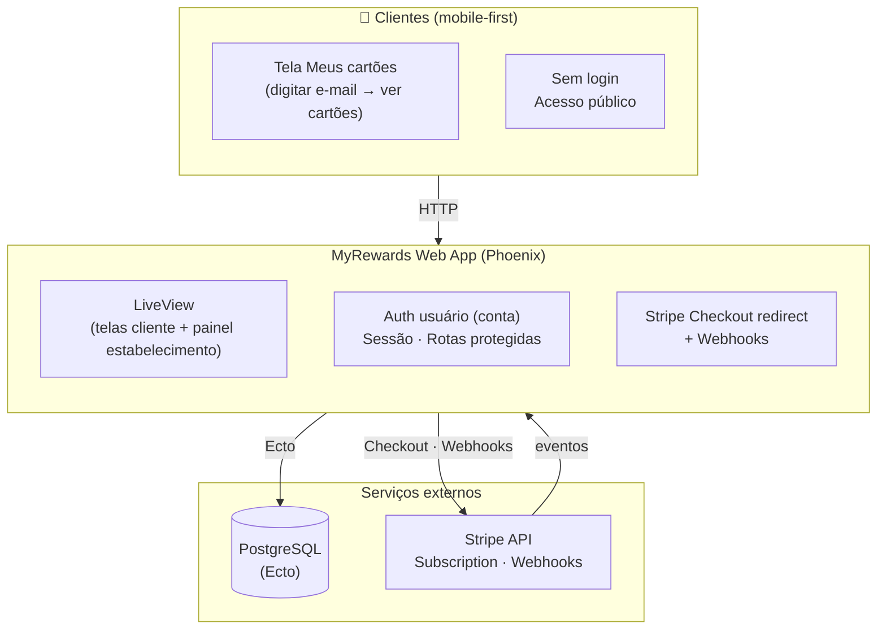

- **Uma única aplicação Phoenix** serve tanto a experiência do **cliente** (telas públicas, mobile-first) quanto o **painel do usuário** (autenticado), que cria e gerencia **estabelecimentos**.
- **PostgreSQL** persiste **contas (users)**, estabelecimentos (por conta), clientes, programas de fidelidade e cartões.
- **Stripe** cuida da assinatura recorrente (R$ 10/mês por estabelecimento) e notifica o app via webhooks.

---

## 2. Componentes do sistema

### 2.1 Phoenix Application (MyRewards)

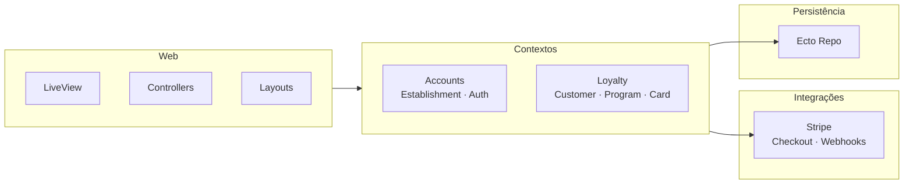

| Camada | Responsabilidade |
|--------|-------------------|
| **Web** | LiveView, controllers, layouts, componentes UI. **Todo layout e CSS mobile-first** (base em viewport pequeno; breakpoints para tablet/desktop). |
| **Contextos** | `Accounts` (User/Account, auth; user has many establishments), `Establishments` ou `Loyalty` (Establishment, LoyaltyProgram, LoyaltyCard, Customer, Stamp se houver). Establishment belongs to account. |
| **Integrações** | `Stripe` (checkout session por estabelecimento, webhooks para subscription/invoice). |
| **Repo** | Ecto; migrations para todas as tabelas do TDD (users/accounts, establishments com account_id, etc.). |

### 2.2 Banco de dados (PostgreSQL)

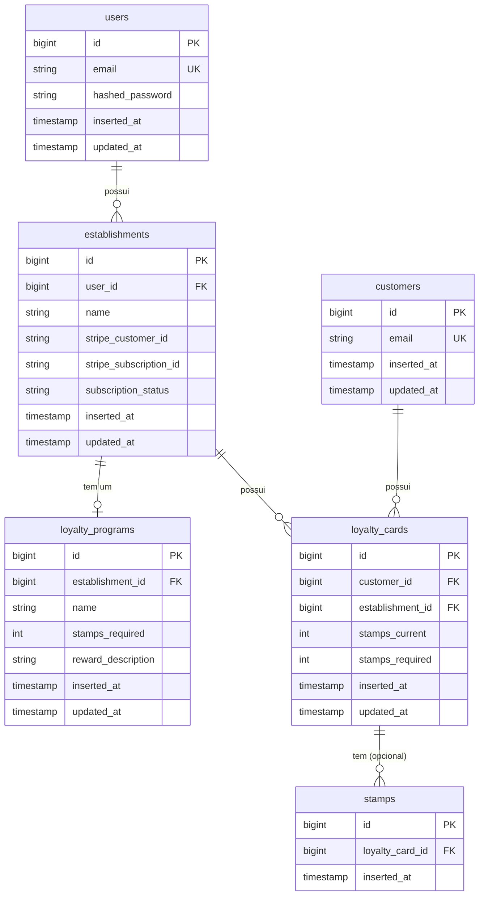

- **users** — conta do usuário (e-mail, senha). Um usuário possui vários estabelecimentos.
- **establishments** — pertence a um usuário (user_id); nome do estabelecimento e status da assinatura Stripe **desse estabelecimento**.
- **loyalty_programs** — 1:1 com establishment; regra (stamps_required, reward_description).
- **customers** — identificado por e-mail (unique).
- **loyalty_cards** — um por par (customer, establishment); progresso stamps_current / stamps_required.
- **stamps** (opcional) — histórico de carimbos por cartão.

Índices: `customers(email)`, `loyalty_cards(customer_id, establishment_id)` único, `loyalty_cards(customer_id)` para listar por cliente.

### 2.3 Stripe

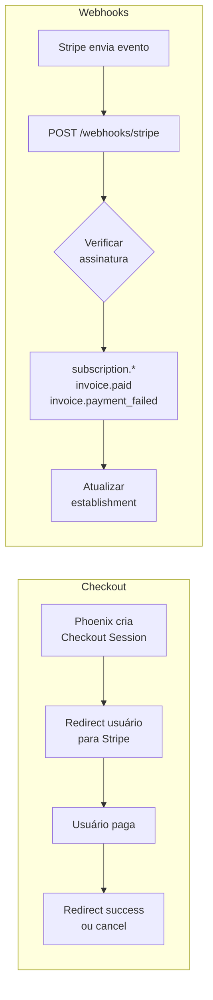

- **Produto/Preço:** 1 produto, preço recorrente mensal BRL R$ 10,00.
- **Checkout:** Criar Session (mode: subscription) após cadastro do estabelecimento; redirect success/cancel.
- **Webhooks (POST /webhooks/stripe):** Verificar assinatura; processar `customer.subscription.created/updated`, `invoice.paid`, `invoice.payment_failed`; atualizar `establishments.subscription_status` e `stripe_subscription_id`.

### 2.4 Front-end e experiência

- **Mobile-first:** Todas as telas são desenhadas primeiro para **viewport pequeno** (ex.: 375px). Depois, media queries `min-width` (ex.: 640px, 1024px) para tablet e desktop.
- **Protótipo:** Em `design/prototype/` há um protótipo estático HTML/CSS das telas principais, em ordem mobile-first, para servir de referência visual (estilo sketch) antes e durante o desenvolvimento.

---

## 3. Mapa de telas e rotas (mobile-first)

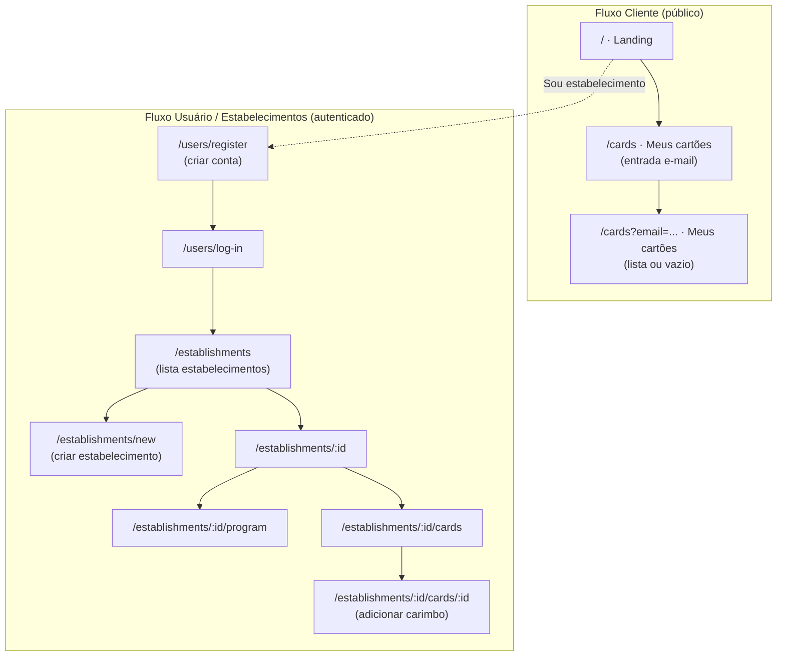

### 3.1 Público (Cliente)

| Rota | Tela | Descrição |
|------|------|-----------|
| `GET /` | Landing | Logo, valor proposto, CTA "Ver meus cartões". |
| `GET /cards` ou `GET /meus-cartoes` | Meus cartões (entrada) | Campo e-mail + botão "Entrar" / "Ver cartões". |
| `GET /cards?email=...` ou POST + redirect | Meus cartões (resultado) | Lista de cartões do cliente: estabelecimento, progresso (ex.: 7/10), recompensa. Empty state se não houver cartões. |

### 3.2 Usuário e estabelecimentos (autenticado)

| Rota | Tela | Descrição |
|------|------|-----------|
| `GET /users/register` | Cadastro de conta | E-mail + senha → criar **conta** (User). |
| `GET /users/log-in` | Login | E-mail + senha → sessão do usuário. |
| `GET /establishments` | Lista de estabelecimentos | Lista estabelecimentos do usuário logado; link "Criar estabelecimento". |
| `GET /establishments/new` | Criar estabelecimento | Nome (e dados opcionais) → criar Establishment → redirect Stripe Checkout (assinatura desse estabelecimento). |
| `GET /establishments/:id` | Detalhe do estabelecimento | Resumo (programa ativo, nº de cartões); links para Programa, Cartões/Clientes. |
| `GET /establishments/:id/program` ou `.../program/edit` | Programa | Editar stamps_required, reward_description (e nome do programa). |
| `GET /establishments/:id/cards` | Cartões / Clientes | Lista de loyalty_cards do estabelecimento; busca por e-mail. |
| `GET /establishments/:id/cards/:card_id` ou modal | Adicionar carimbo | Detalhe do cartão; botão "+1 carimbo"; exibir progresso. |

Rotas atrás de `require_authenticated_user`; o usuário só acessa estabelecimentos da própria conta.

---

## 4. Fluxo de dados resumido

### 4.1 Cliente vê cartões

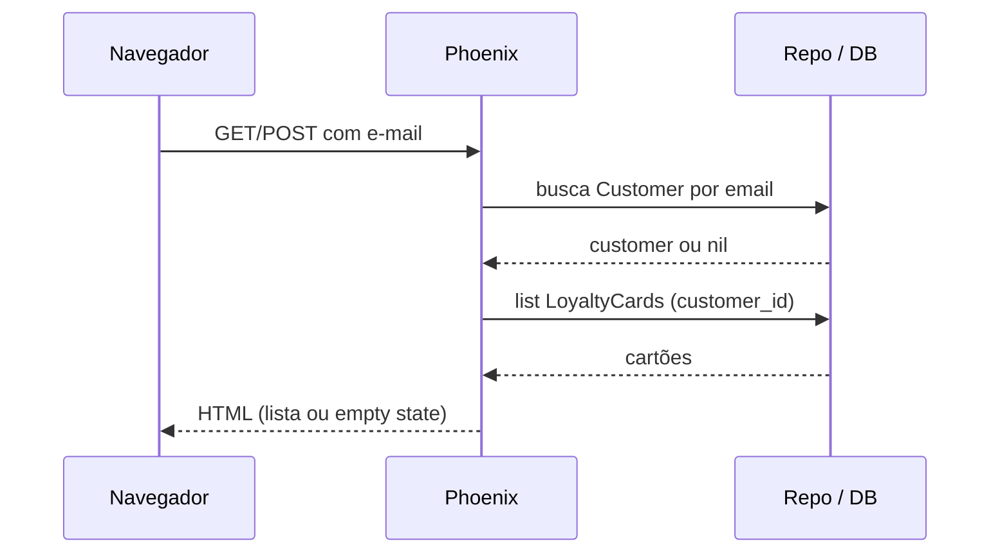

### 4.2 Estabelecimento cadastra cliente

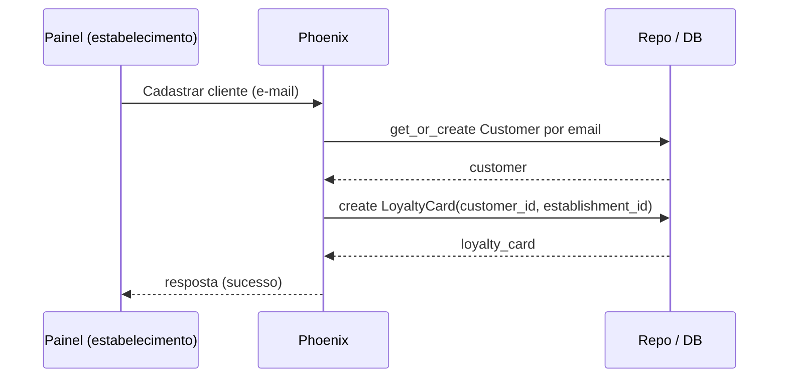

### 4.3 Estabelecimento adiciona carimbo

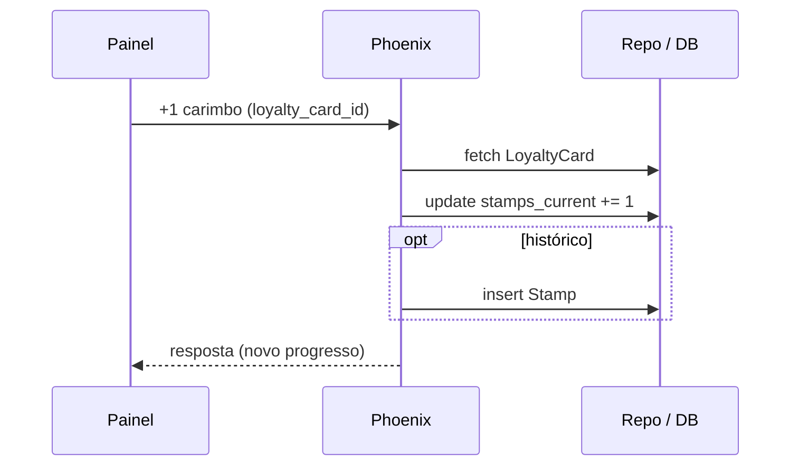

### 4.4 Conta, estabelecimento e assinatura Stripe

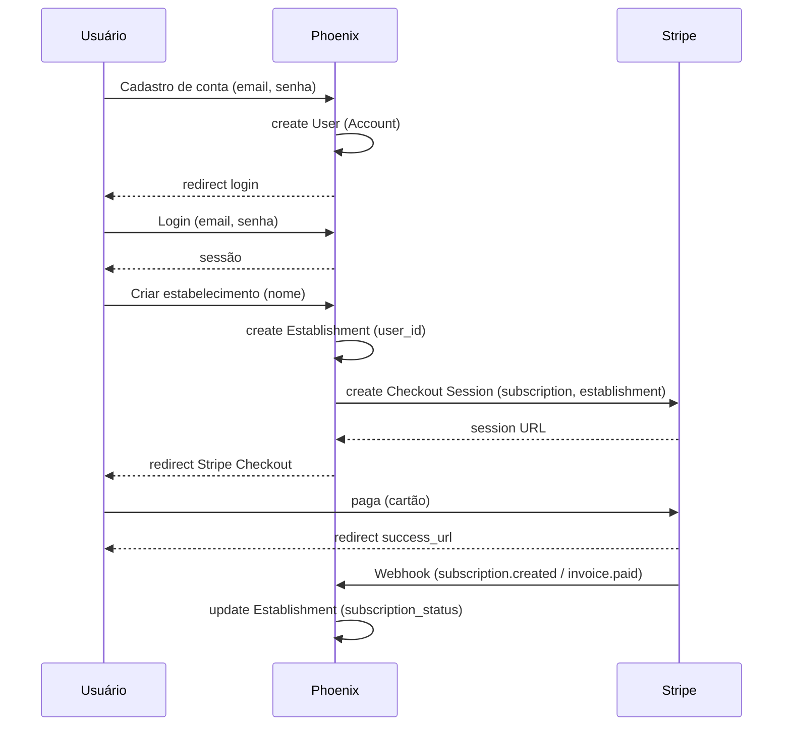

---

## 5. Segurança e limites

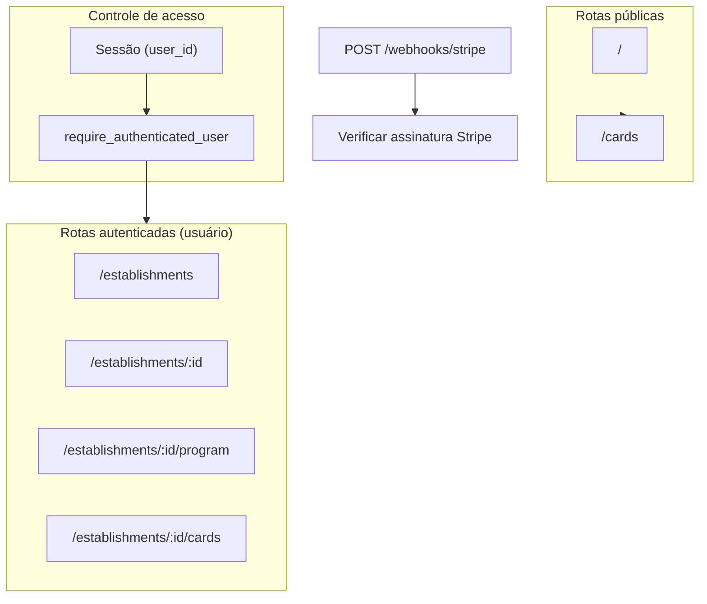

- **Usuário (conta):** Sessão após login; o usuário só acessa estabelecimentos que pertencem à sua conta (user_id); apenas esses loyalty_cards e programas.
- **Cliente:** Acesso aos cartões apenas por e-mail (sem senha no MVP); considerar rate limit no endpoint "Meus cartões" por IP/e-mail.
- **Webhooks Stripe:** Sempre validar assinatura; processar de forma idempotente quando possível.

---

## 6. Deployment (sugestão para “pronto para desenvolver”)

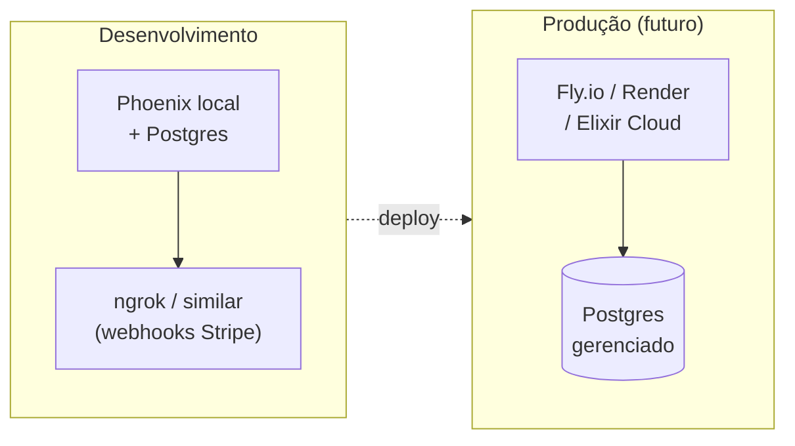

- **Ambiente:** Desenvolvimento local (Phoenix, Postgres, ngrok ou similar para Stripe webhooks).
- **Produção (futuro):** App em Fly.io/Render/Elixir Cloud; Postgres gerenciado; Stripe em modo live; variáveis de ambiente para `STRIPE_SECRET_KEY`, `STRIPE_WEBHOOK_SECRET`, `DATABASE_URL`.

---

## 7. Protótipo mobile-first (design/prototype)

- **Objetivo:** Referência visual estática de todas as telas, **sempre mobile-first**, em estilo sketch, para alinhar produto e desenvolvimento.
- **Local:** `design/prototype/`. 
- **Conteúdo:** 
  - `index.html` — Índice com links para cada tela (cliente e estabelecimento).
  - Telas em HTML com CSS mobile-first (base 320–375px; depois 640px+).
  - Frame opcional de “celular” para reforçar mobile-first.
- **Uso:** Abrir `design/prototype/index.html` no navegador (ou servir a pasta com um servidor estático). Desenvolver as LiveViews seguindo o layout e a hierarquia do protótipo.

---

## 8. Checklist “pronto para desenvolver”

- [x] Concept doc (CONCEPT.md)
- [x] TDD (TDD.md) com modelo de dados, fluxos e Stripe
- [x] System Design (este doc) com arquitetura, componentes e rotas
- [x] Design (DESIGN.md) com cores e layout
- [x] Screens (SCREENS.md) com copy, campos e IDs para testes
- [x] MVP Backlog (MVP_BACKLOG.md) com ordem de implementação e decisão de auth
- [x] Protótipo mobile-first em `docs/design/prototype/` (sketch das telas)
- [ ] Migrations Ecto (users, establishments com user_id, loyalty_programs, customers, loyalty_cards)
- [ ] Contextos Accounts (User), Establishments/Loyalty (Establishment, programa, cartões)
- [ ] Auth usuário (conta); usuário tem muitos estabelecimentos
- [ ] LiveViews públicas (landing, meus cartões)
- [ ] LiveViews: lista de estabelecimentos, criar estabelecimento, painel por estabelecimento (programa, cartões, +1 carimbo)
- [ ] Integração Stripe (checkout + webhooks)
- [ ] Testes (contextos e LiveView críticos)

---

*Documento de sistema derivado do [TDD](TDD.md) e do [Concept](CONCEPT.md). O desenvolvimento deve seguir o protótipo em `design/prototype/` e este system design.*
